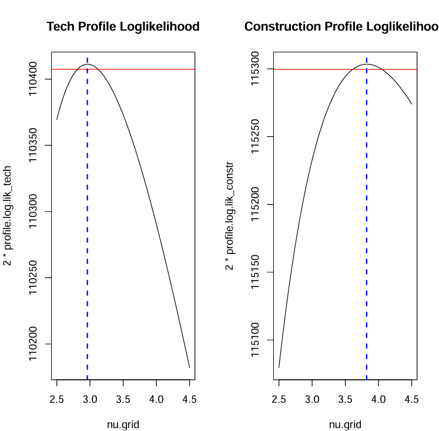
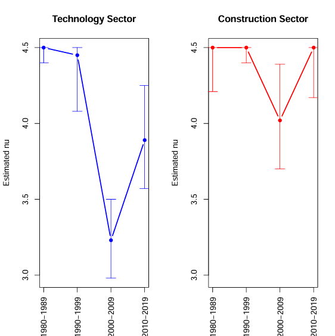
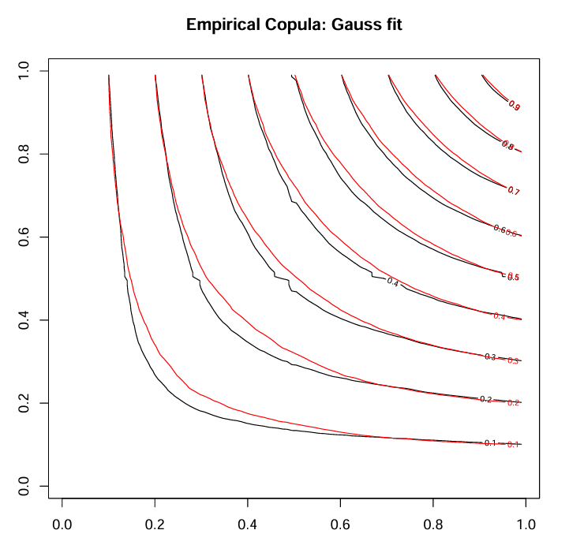
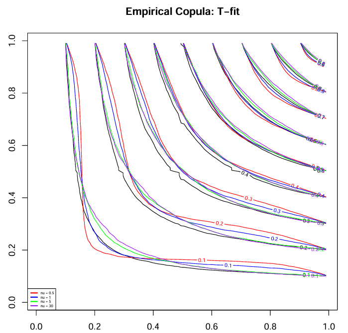
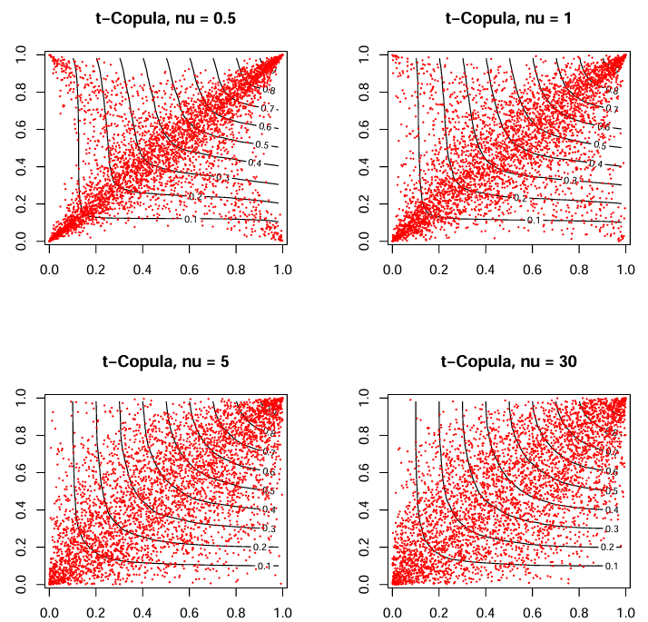
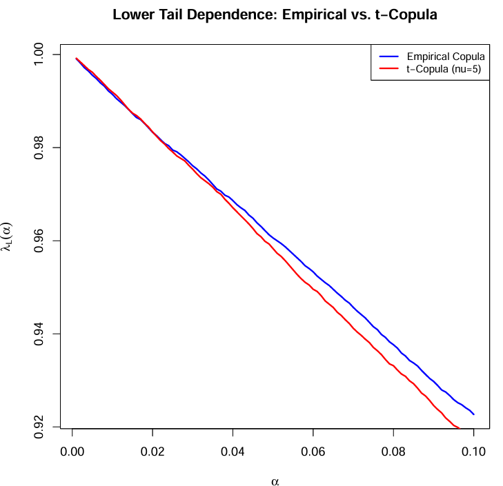

# 📊 Robust Dependence Modeling and Copula Simulation in R

This repository provides an end-to-end framework for **multivariate dependence modeling** using **t-distributions** and **copula theory**. The code is implemented in R with LaTeX integration (`.Rnw`) and demonstrates:

- Robust estimation of multivariate t-distribution parameters using profile likelihood
- Sector-wise and decade-wise comparison of financial return distributions
- Simulation and calibration of Gaussian and t-copulas
- Visualization of empirical vs. simulated copulas
- Estimation of tail dependence coefficients

## 🧮 Sample Code

```r
loglik_t <- function(nu, data) { 
  mu_hat <- colMeans(data)
  cov_hat <- cov(data)
  loglik <- dmvt(data, delta = mu_hat, sigma = cov_hat, df = nu, log = TRUE)
  sum(loglik)
}

nu.grid <- seq(2.5, 4.5, 0.01)
profile.log.lik <- sapply(nu.grid, loglik_t, data = stock_data)

# Confidence interval threshold (chi-squared 95%)
threshold <- max(profile.log.lik) - qchisq(0.95, df = 1) / 2

U_empirical <- pobs(cbind(stock1, stock2))  # pseudo-observations from returns

# Estimate Kendall's tau
tau <- cor(U_empirical[,1], U_empirical[,2], method = "kendall")
rho <- sin(tau * pi / 2)  # Convert to Gaussian copula rho

sim_Gauss_copula <- function(n, rho) {
  library(MASS)
  Sig <- matrix(c(1, rho, rho, 1), nrow = 2)
  z <- mvrnorm(n, mu = c(0, 0), Sigma = Sig)
  pnorm(z)
}

# Simulate t-copula
sim_T_copula <- function(n, Sig, nu) {
  z <- MASS::mvrnorm(n, mu = rep(0, ncol(Sig)), Sigma = Sig)
  t_sample <- z / sqrt(rchisq(n, df = nu) / nu)
  pt(t_sample, df = nu)
}

lambda <- function(data, p, upper = FALSE) {
  x <- data[,1]
  y <- data[,2]
  u_x <- rank(x) / (length(x) + 1)
  u_y <- rank(y) / (length(y) + 1)

  sapply(p, function(a) {
    if (upper) {
      sum(u_x > 1 - a & u_y > 1 - a) / sum(u_x > 1 - a)
    } else {
      sum(u_x < a & u_y < a) / sum(u_x < a)
    }
  })
}

alpha_seq <- seq(0.001, 0.1, length.out = 100)
lambda_empirical <- lambda(U_empirical, alpha_seq)

copula_plot <- function(U, title) {
  library(copula)
  contourplot(copulaEmpirical(U), main = title)
}
```

---

## 📁 Project Files

| File | Description |
|------|-------------|
| `Robust-Dependence-Modeling-and-Copula-Simulation.Rnw` | Main R + LaTeX source |
| `Robust-Dependence-Modeling-and-Copula-Simulation.pdf` | Compiled report |
| `stock_returns.csv` | Daily return data of tech & construction sector stocks |

---

## 🧩 Sector Profile Likelihood Estimation

- Fitted separate multivariate t-distributions for **tech** (AAPL, AMD, INTC, IBM) and **construction** (AA, CAT, F, MMM) sectors
- Estimated ν using profile log-likelihood
- Constructed 95% confidence intervals from chi-squared thresholds

📈 Profile likelihood curves:



📊 Decade-wise ν Estimates with CI:



**Result:**
- **Tech sector**: more heavy-tailed (lower ν), higher volatility
- **Construction sector**: more stable (higher ν), lighter tails

📈 Profile likelihood plots showed **non-overlapping CIs**, confirming significantly different distributions.

---

## 🧭 Decade-wise Analysis (1980s–2010s)

Estimated ν and 95% CIs for both sectors per decade:

| Decade     | Sector       | ν̂ MLE | CI Lower | CI Upper |
|------------|--------------|--------|----------|----------|
| 1980–1989  | Tech         | 4.50   | 4.40     | 4.50     |
| 1980–1989  | Construction | 4.50   | 4.21     | 4.50     |
| 1990–1999  | Tech         | 4.45   | 4.08     | 4.50     |
| 1990–1999  | Construction | 4.50   | 4.40     | 4.50     |
| 2000–2009  | Tech         | 3.23   | 2.98     | 3.50     |
| 2000–2009  | Construction | 4.02   | 3.70     | 4.39     |
| 2010–2019  | Tech         | 3.89   | 3.57     | 4.25     |
| 2010–2019  | Construction | 4.50   | 4.17     | 4.50     |

**Insights:**
- Tech sector ν dropped significantly in 2000s, indicating heavier tails.
- Construction sector remained more stable across decades.

---

## 🔁 Copula Simulation and Calibration

- Implemented `sim_Gauss_copula()` and `sim_T_copula()` for generating Gaussian and t-copula samples
- Calibrated copulas for IBM & CAT using empirical Kendall’s τ
- Compared empirical vs. simulated copulas for various ν values

📌 Gaussian Copula Fit (Red = Model, Black = Empirical):


📌 t-Copula Fit for Various Degrees of Freedom:


📌 t-Copula Simulated Scatter Plots with Contours:


```r
sim_T_copula <- function(n, Sig, nu){
  Z = MASS::mvrnorm(n, mu = rep(0, ncol(Sig)), Sigma = Sig)
  T = Z / sqrt(rchisq(n, df=nu) / nu)
  U = pt(T, df=nu)
  return(U)
}
```
---
## 🧩 Tail Dependence Estimation
Plotted empirical vs. t-copula lower tail dependence:


```r
plot(alpha_seq, lambda_empirical, type="l", col="blue", lwd=2,
     xlab=expression(alpha), ylab=expression(lambda[L](alpha)))
lines(alpha_seq, lambda_t_copula, col="red", lwd=2)
legend("topright", legend=c("Empirical", "t-Copula (ν=5)"), col=c("blue", "red"), lty=1)
```

---

## 💻 How to Compile

To reproduce the report:

1. Open `Robust-Dependence-Modeling-and-Copula-Simulation.Rnw` in **RStudio**
2. Set knitting engine to **knitr**
3. Click **Knit to PDF**
